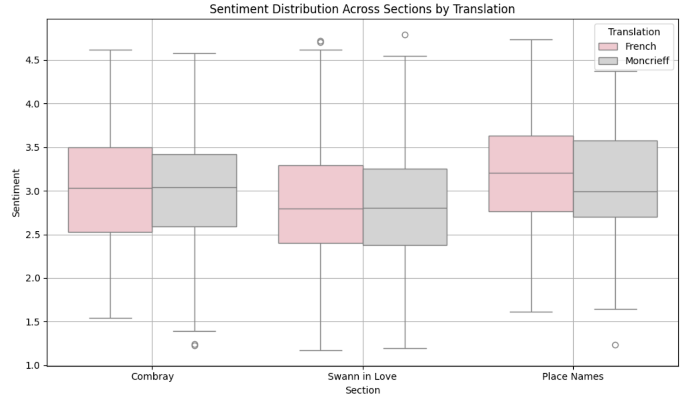
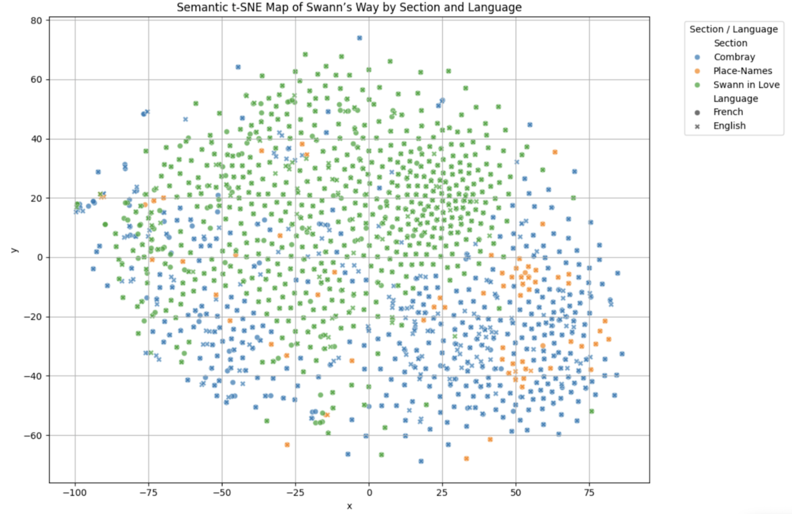

# Proust NLP Project

## Overview
This project evaluates C.K. Scott Moncrieff’s English translation of Marcel Proust’s *Swann’s Way* against the original French text using statistics, machine learning, and natural language processing (NLP) techniques.

The analysis explores differences and similarities in:
- **Sentence length distributions**
- **Word frequency and vocabulary variety**
- **Sentiment analysis**
- **Sentiment arcs over the text**
- **Semantic similarity**
- **Topic modeling**

Diagrams generated in the project visualize these comparisons.

---

## Introduction
The study investigates what is gained and lost in translating one of literature’s most celebrated works. By quantifying linguistic features and semantic patterns, the goal is to provide insight into both the translation process and the limitations of applying statistical methods to literature.

---

## Methods
- **Sentence Length & Word Frequency**: Used spaCy to tokenize French and English versions; analyzed Zipf’s Law adherence.
- **Sentiment Analysis**: Applied multilingual BERT model to compare sentiment distributions by section.
- **Sentiment Arcs**: Computed rolling averages of sentiment over paragraph indices.
- **Semantic Similarity**: Used LaBSE embeddings with t-SNE visualization to compare paragraph-level meaning.
- **Topic Modeling**: Employed BERTopic to extract and compare thematic clusters.

---

## Dependencies Needed
- The project was completed in Python. To reproduce results, run the notebook "proustNLP.ipynb". A full write-up and analysis of the results can be found at the attached PDF "ProustNLPreport.pdf"
- To following libraries are necessary to run the program: requests, spacy, re, matplotlib, collections, numpy, scipy, transformers, torch, seaborn, pandas, sentence_transformers, sklearn, BERTopic

---
## Results

### 1. Sentence Length & Word Frequency
- Moncrieff preserved Proust’s long sentences but split many medium-length ones.
- Vocabulary diversity in English closely matched French.
- Both texts followed Zipf’s Law.

### 2. Sentiment Analysis
- Median sentiments centered around neutral for both texts.
- Differences most noticeable in the "Place Names" section.

### 3. Sentiment Arcs
- Sentiment trajectories between versions were similar, suggesting preserved mood transitions.

### 4. Semantic Similarity
- Moncrieff's translation closely aligned semantically with the French text.
- "Swann in Love" was most semantically uniform; "Combray" most scattered.

### 5. Topic Modeling
- The top two most populated topics for English and French were un-interpretable.
- The remaining two English topics focused on tangible items (nature, money).
- The remaining two French topics focused on aesthetics (art, music).

---

## Conclusion
Moncrieff’s translation:
- Preserves Proust’s long sentences and vocabulary variety.
- Maintains overall sentiment arcs and semantic coherence.
- Differs in topic emphasis, potentially due to linguistic or stylistic choices.

While NLP provides measurable insights, literature’s artistry resists full capture by quantitative methods.

